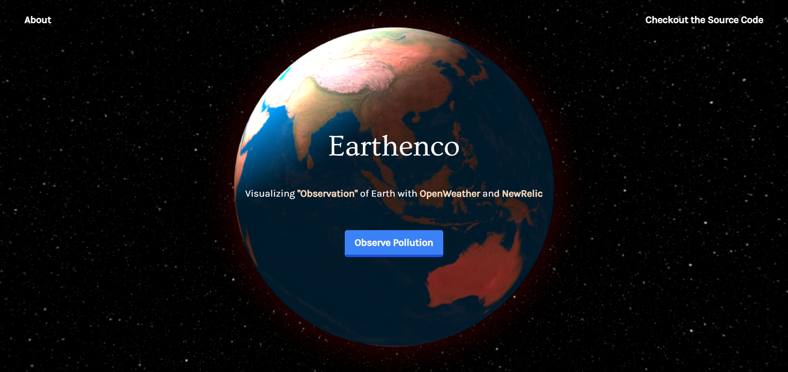

# Earthenco



> One stop observability centre to battle Air Pollution!

## The Problem

- Air Pollution is something that we humans have not paid attention to
- Various chemical production and unregulated pollution destroy's our environment

## What is Earthenco?

Earthenco is a one-stop "Observability" center where you can view various Air Particle data of anyplace anytime!

Earthenco aims to spread awareness about Air Pollution and recommned what plants you could plant to make your environment healthier.

## Installation

```terminal
git clone https://github.com/DarthBenro008/earthenco
cd earthenco
npm install
npm start
```

### Sample .env file

```bash
REACT_APP_KEY_OWA=
```

## Techstack

- React
- OpenWeather API
- BigData ReverseGeoCoding API


## Author
👨‍💻 Hemanth Krishna [@DarthBenro008](http://github.com/DarthBenro008)

## Show your support

Give a ⭐ if this project made your life easy!

Spread the word to your fellows to help grow a healthy environment for us!

## Contributions

- Feel Free to Open a PR/Issue for any feature or bug(s).
- Make sure you follow the community guidelines!
- Feel free to open an issue to ask a question/discuss anything about Earthenco.
- Have a feature request? Open an Issue!

## License

Copyright 2021 Hemanth Krishna

Licensed under MIT License : https://opensource.org/licenses/MIT